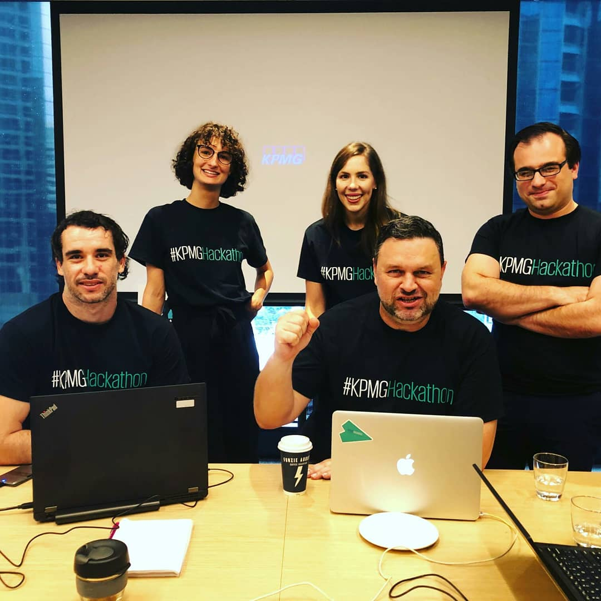

# Hackathon

GoTime Phone App to predict (neural network) bus delays caused to unexpected incidents. Receiving the Customer Focus award for our efforts.

# Problem
Have you ever wondered what happened to your bus? While the TransLink app works extremely well in normal traffic conditions, it struggles to provide relevant information and useful alternative options when the unexpected happens –such as accidents or road closures on the bus network. This means customers cannot make an informed decision as to what is their best option to get to their destination on time.

# Solution
As part of the TMR Hack and the KPMG Hackathon, Marco Motta and John Worrall, from the Transport Analysis team at PPI, led the charge in developing the concept for a system that uses neural network analytics to predict bus delays caused by unexpected incidents

## Dependencies
- Ruby on Rails
- R

*Note: repo does contain code on data wraggling or GUI, only R code for explored prediction techniques on GTFS data and final model assessment.  

        

        

        <small>Schedule event</small>
        

  

        
        

        <small>Results</small>
        

  

        
        
        

        <small>Winning Team</small>
        

  

